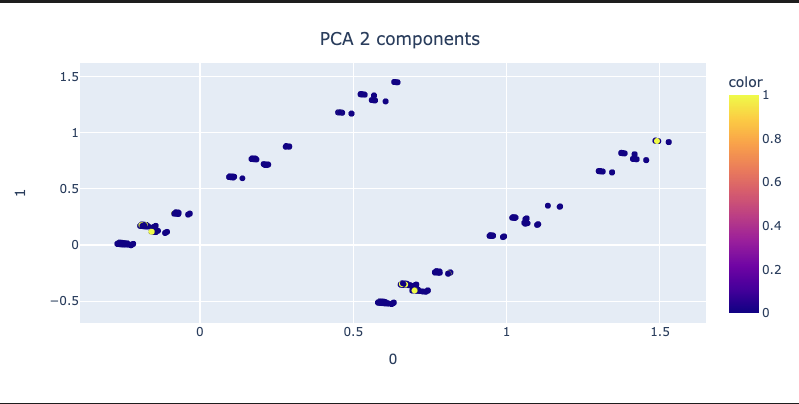

# EDSA - BOOTCAMP Project Group T1B

Bootcamp project for the Enterprise Data Science Bootcamp course of the 2022 Postgraduate Program in Enterprise Data Science & Analytics of NOVA IMS

## Group

## Project description

## How to run

* Install Python and Conda
* Install all packages that are referenced in config.py
* Run each book in sequential order (00_* to 05_*)
* Each step exports a dataframe (.h5 file) to the 'cache" folder that is imported by next step so each step can run any times needed without the need to rerun the previous steps
  
## Project Diagram



## Folder structure

```
lib
│
│   README.md               
│
│   project_diagram.png
│
│   config.py
│   imports.py
│   functions.py
│   pipeline_functions.py
│
│   00_data_import.ipynb
│   01_data_understanding.ipynb
│   02_data_cleaning.ipynb
│   03_new_features.ipynb
│   04_features_selection.ipynb
│   05_models_testing.ipynb
│   05_models_testing_nn.ipynb
│
├───output                  
│   ├───profile_report.html [ Panda profile report ]         
│   └───... 
│
├───cache           [will be created during run to hold the result files from each step]
├───cache_reduced   [will be created during run to hold the result files from each step]
├───temp            [will be created during run to hold temo files]
