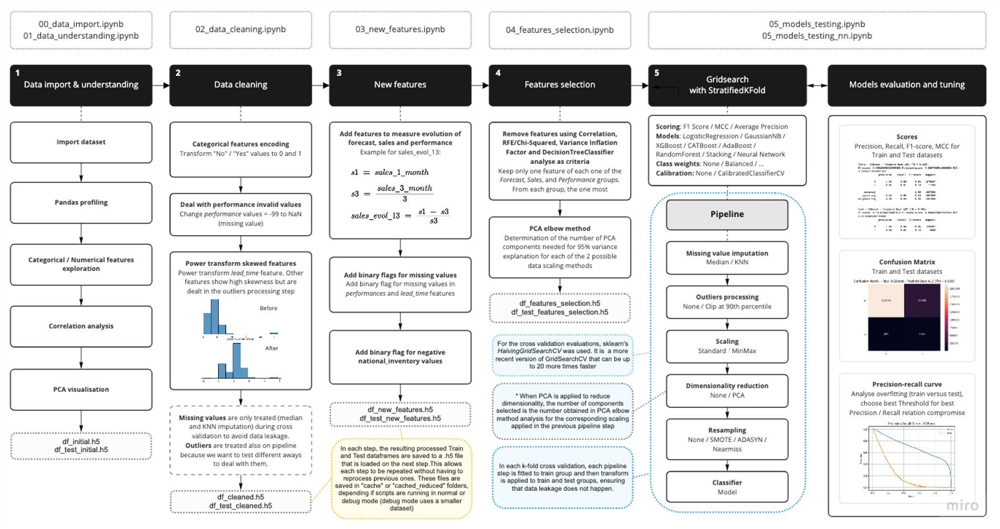

<p align="center">
  
</p>

# EDSA - BOOTCAMP Project Group T1B

Bootcamp project for the Enterprise Data Science Bootcamp course of the 2022 Postgraduate Program in Enterprise Data Science & Analytics of NOVA IMS

## Group T1B

* Adryelle Rios - 20211053
* Marta La Feria - 20211051
* Nuno Felicio - 2021823
* Pedro Assis - 20211368

## Project description

Check [project document](input/BI4ALL_-_NOVA_IMS_-_Back_Orders_Prediction.pdf)
## How to run

* Install Python and Conda
* Install all packages that are referenced in config.py
* Unzip datasets files (in input folder)
* Run each jupyter notebook in sequential order (00_* to 05_*)
* Each step exports a dataframe (.h5 file) to the 'cache" folder that is imported by next step so each step can run any times needed without the need to rerun the previous steps
  
## Project Diagram

<p align="center">

</p>

## Folder structure

```
lib
│
│   README.md               
│
│   project_diagram.png
│
│   config.py       [configuration of several parameters of the process]
│   imports.py      [all imports needed in all files]
│   functions.py    [custom functions used in all files]
│   pipeline_functions.py   [custom functions used during gridsearch/pipeline]
│
│   00_data_import.ipynb            [Data import]
│   01_data_understanding.ipynb     [Data understanding / exploration]
│   02_data_cleaning.ipynb          [Data cleaning]
│   03_new_features.ipynb           [Add new features]
│   04_features_selection.ipynb     [Features selection]
│   05_models_testing.ipynb         [Models testing and tunning]
│   05_models_testing_nn.ipynb      [NN models testings]
│
├───input            Has project description document and datasets
|
├───output                  
│   ├───profile_report.html [ Panda profile report ]         
│   └───... 
│
├───cache           [will be created during run to hold the result files from each step]
├───cache_reduced   [will be created during run to hold the result files from each step]
├───temp            [will be created during run to hold temo files]
